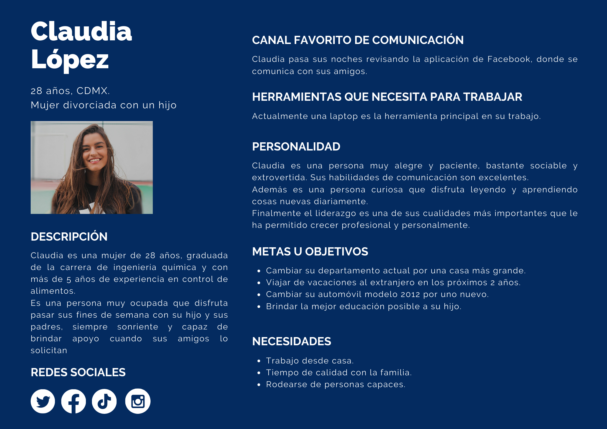

# Abogabot

Práctica 1 del programa 'LaunchX'

## Caso de estudio: Abogabot

Un despacho de abogados desea automatizar el proceso de levantar una demanda y hacerlo más fácil y accesible para sus clientes, esta idea surge a raíz de la pandemia iniciada en 2020.
Se propone desarrollar una aplicación web que permita a los usuarios registrarse y generar una demanda mediante un formulario, posteriormente podrá consultar el estado de las demanda levantadas.

## Usuarios

- Cliente: usuario interesado en hacer uso de la aplicación y levantar demandas.
- Administrador: miembros del despacho de abogados.

## Definición de requerimientos

En el siguiente [archivo](./RequerimientosAbogabot.pdf) se presenta la definición de requerimientos para la aplicación.

## Definición de 'buyer persona'

Buyer Persona es la representación ficticia de tu cliente ideal. Está basada en datos reales sobre el comportamiento y las características demográficas de tus clientes, así como en una creación de sus historias personales, motivaciones, objetivos, retos y preocupaciones [[1]](https://www.rdstation.com/es/blog/buyer-persona/).

A continuación se presenta el buyer persona de Abogabot.

## Público objetivo

El público objetivo de Abogabot está formado por personas de entre 18 y 60 años que viven en CDMX o Área Metropolitana y cuentan acceso a dispositivos con conexión a Internet. Este público cuenta con poco tiempo en la semana debido a su trabajo, pero que utilizan sus fines de semana para atender sus pendientes.

El público objetivo cuenta con una cuenta bancaria y tiene ingresos mensuales fijos de al menos 8,000 pesos mexicanos.

## Wireframe UX

También llamado plan de pantalla por algunos profesionales, el wireframe es un prototipo de página web o de una aplicación, que sirve como una guía para auxiliar para la diagramación de una página [[2]](https://rockcontent.com/es/blog/wireframe/).
